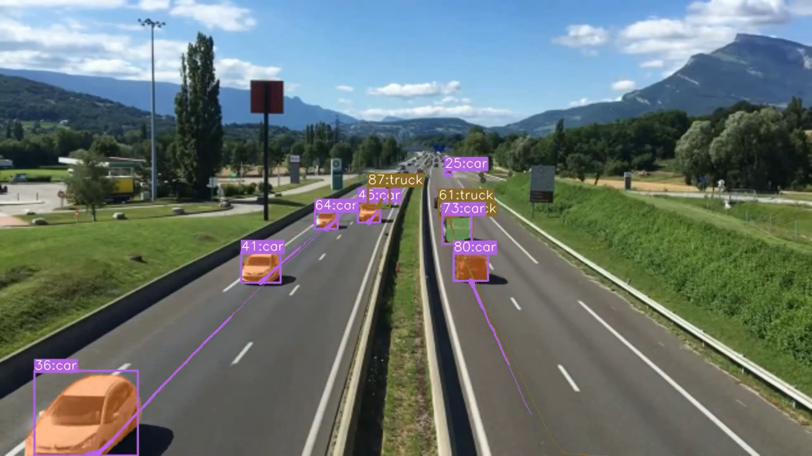
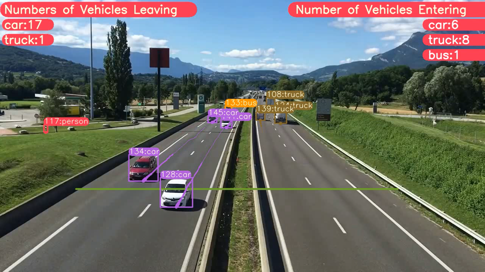

# Advanced-Multiple-Object-Tracking-System-Using-Deep-SORT-and-YOLOv7

[](https://opensource.org/licenses/MIT)
[](https://github.com/ayushgoel24/Advanced-Multiple-Object-Tracking-System-Using-Deep-SORT-and-YOLOv7/issues)
[](https://github.com/ayushgoel24/Advanced-Multiple-Object-Tracking-System-Using-Deep-SORT-and-YOLOv7)

This repository contains code for implementing Visual Odometry using stereo images from the Kitti dataset. The aim of this project is to estimate the camera motion and generate a trajectory using stereo images.

## Table of Contents
- [Overview](#overview)
- [Features](#features)
- [Pipeline](#pipeline)
- [Key Concepts Used](#key-concepts-used)
- [Getting Started](#getting-started)
- [Structure](#structure)
- [Dependencies](#dependencies)
- [Results](#results)
- [License](#license)
- [Contact](#contact)
- [Acknowledgements](#acknowledgements)

## Overview
This project integrates the cutting-edge YOLOv7 object detection model with the DeepSORT tracking algorithm to create a robust system for real-time object tracking. It is designed to accurately detect and track multiple objects across video frames, providing valuable insights for applications ranging from surveillance to traffic management and retail analytics.

## Features
- Real-time object detection and tracking using YOLOv7 and DeepSORT.
- High accuracy and efficiency in detecting various object classes.
- Scalable to different video resolutions and frame rates.
- Customizable for specific tracking requirements and environments.
- Visualization tools for tracking analysis and result presentation.

## Pipeline
The project pipeline consists of the following steps:

1. Object Detection: Utilize YOLOv7 for high-precision object detection in each video frame.

2. Data Association: Implement DeepSORT to associate detected objects across frames, maintaining identity consistency.

3. Tracking: Continuously track objects, updating their positions and handling occlusions or identity switches.

4. Visualization: Render the tracked objects with bounding boxes and identifiers on the video for analysis and review.

## Key Concepts Used

- YOLOv7: A state-of-the-art object detection model known for its speed and accuracy.
- DeepSORT: An advanced tracking algorithm that uses deep learning features for improved data association and tracking stability.
- Data Association: Critical for linking detection instances over time to maintain track continuity.
- Kalman Filtering: Utilized within DeepSORT for predicting object motion and updating tracks.
- Feature Extraction: DeepSORT employs a CNN model to extract features for association, enhancing tracking accuracy.

## Getting Started

To get started with this project, clone the repository, install the necessary dependencies, and follow the provided instructions to run the object tracking system on your video data.

```bash
git clone https://github.com/ayushgoel24/Advanced-Multiple-Object-Tracking-System-Using-Deep-SORT-and-YOLOv7
cd Advanced-Multiple-Object-Tracking-System-Using-Deep-SORT-and-YOLOv7
pip install -r requirements.txt
```

## Structure
The project is organized into several key directories:

- `cfg/`: Configuration files for YOLOv7 and tracking parameters.
- `data/`: Directory for storing input data and detection results.
- `models/`: YOLOv7 and DeepSORT model files.
- `scripts/`: Python scripts for detection, tracking, and utility functions.
- `notebooks/`: Jupyter notebooks for demonstrations and result analysis.
- `utils/`: Utility scripts for various functions including data processing and visualization.

## Dependencies
The project requires the following main dependencies:

- Python 3.x
- PyTorch
- OpenCV
- NumPy
- Matplotlib

A full list of dependencies is available in the requirements.txt file.

## Results

The project demonstrates high-performance object tracking with the integration of YOLOv7 and DeepSORT. The results include accurately tracked objects across video sequences, showcasing the system's ability to handle occlusions, varying object speeds, and different lighting conditions.


### Output GIF of the visual odometry


#### Vechicles Detection & Tracking
<!-- | Image 1 | Image 2 | -->
|---------|---------|
|  |  |


## License

This project is licensed under the [MIT License](LICENSE).

## Contact

For any issues, queries, or feedback, please contact: [ayush.goel2427@gmail.com].

## Acknowledgements

Special thanks to the original developers of the YOLOv7 and DeepSORT algorithms for their outstanding contributions to the field of computer vision and object tracking. This project was inspired by and built upon the foundational works available at YOLOv7 and DeepSORT repositories.

Happy coding!